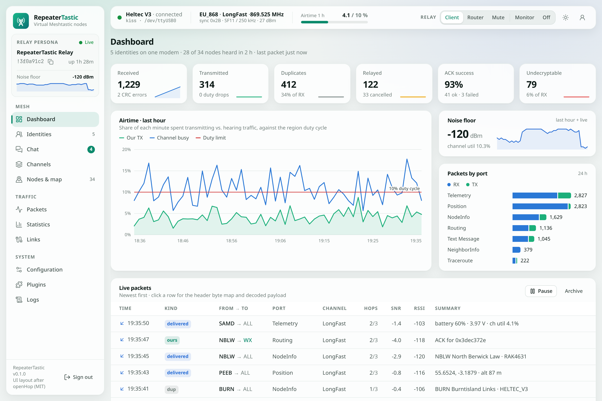

<p align="center">
  <picture>
    <source media="(prefers-color-scheme: dark)" srcset="docs/images/repeatertastic-lockup-dark.png">
    
  </picture>
</p>

# RepeaterTastic

**Many Meshtastic nodes, one LoRa modem.** RepeaterTastic runs as many virtual Meshtastic nodes
as you like on a Raspberry Pi (or any Linux box) with a cheap LoRa board on USB. Every virtual
node is a real Meshtastic node to the mesh and to the apps. One of them repeats; the rest are yours
to chat, bridge and experiment with. Built and run by [ScotMesh](https://github.com/ScotMesh) for
Scottish mesh sites, and useful anywhere.



- **Virtual nodes ("identities")** with their own key, node number, channels and app port. The
  official Meshtastic apps, the Python CLI and the web client connect to each one as if it were a radio.
- **A proper repeater:** one relay persona follows the firmware's flooding and next-hop rules, with
  a shared duty-cycle budget, so ten identities never mean ten repeats. Switch it between client,
  router and mute, or put the radio in Monitor (listen only) or Off from the top bar.
- **A web GUI** for everything: identities, chat (as any identity, the relay persona included),
  channels, a live node map, packets, statistics, logs, backups and configuration.
- **Several radios on one host** (LongFast, MediumFast, …) that take turns on shared frequencies.
- **MQTT** to one or more brokers (gateway, uplink-only, map reports, monitor, bridge), a fixed
  site position, device telemetry and an optional UDP multicast link to `meshtasticd` on the LAN.
- **Plugins** add uploaders, bots and dashboards: upload a .zip in the GUI or drop it in a folder,
  choose what each one may see, and cap how much it may send.
- **One static binary or one container.** About 10 MB, no CGO, GUI embedded.

> **Status:** running on a ScotMesh site on a Heltec V3, alongside Reticulum. Still young: expect
> changes. Verified: byte-exact against 25 golden vectors from meshtasticd 2.7.26 and 2.8.0; PKI DMs
> with ACKs against real meshtasticd; the official apps and CLI on the identity ports; on-air channel
> messages and DMs; multi-radio routing in simulation.

## Quick start

### 1. Get a modem

RepeaterTastic drives a LoRa board running **Mesh KISS**: MeshCore's KISS modem firmware patched to
speak Meshtastic's PHY. Heltec V3/V4, XIAO nRF52840 + Wio-SX1262, RAK4631, T-Beam and more are
supported. Download a prebuilt image (`kiss-firmware-<board>.zip`) from the
[latest release](https://github.com/ScotMesh/RepeaterTastic/releases/latest) or build it, then flash:

```bash
esptool.py --chip esp32s3 --port /dev/ttyUSB0 write_flash 0x0 Heltec_v3_kiss_modem-factory.bin   # ESP32 boards
# nRF52 boards: double-tap reset and copy the .uf2 onto the USB drive that appears
```

Plug it into the host and find its stable path: `ls -l /dev/serial/by-id/`. More in
[Hardware and modems](docs/hardware.md).

### 2a. Run it with Docker

```bash
docker run -d --name repeatertastic --restart unless-stopped \
  --network host \
  --device /dev/serial/by-id/usb-…-if00-port0:/dev/ttyUSB0 \
  --group-add "$(getent group dialout | cut -d: -f3)" \
  -e REPEATERTASTIC_RADIO_DEVICE=/dev/ttyUSB0 \
  -v repeatertastic-data:/data \
  ghcr.io/scotmesh/repeatertastic:latest
```

- `--device` passes the modem in; `--group-add` lets the unprivileged container user open it.
- `--network host` lets the apps find identities over mDNS and joins the LAN multicast mesh. Without
  it, publish `-p 8080:8080 -p 4403-4410:4403-4410` instead.
- The `/data` volume holds the config, identity keys and chats. Back it up.
- Prefer Compose? Copy [`deploy/docker-compose.example.yml`](deploy/docker-compose.example.yml).
- The image is published to `ghcr.io` with each release. To run your own build instead, build it
  with `docker build -t repeatertastic .` and use `repeatertastic` as the image name.

### 2b. Or run it standalone (systemd)

```bash
git clone https://github.com/ScotMesh/RepeaterTastic && cd RepeaterTastic
# binaries from the latest release: arm64 = 64-bit Raspberry Pi OS; armv7, armv6 and amd64 also available
gh release download -R ScotMesh/RepeaterTastic -p 'repeatertastic-linux-arm64' -p 'kisstool-linux-arm64'
sudo ./deploy/install.sh ./repeatertastic-linux-arm64 ./kisstool-linux-arm64
journalctl -u repeatertastic -f
```

The installer creates a `repeatertastic` user in `dialout`, installs the systemd unit and writes
`/etc/repeatertastic/repeatertastic.yaml`, pointing it at the first USB serial device it finds
(check it if several boards are plugged in).

### 3. Set it up in the browser

1. Open `http://<host>:8080` and choose the admin password.
2. The setup wizard finds the modem, sets region and preset, and checks the modem accepts Meshtastic's sync word.
3. **Identities → New identity** creates a virtual node and gives it an app port.
4. In the Meshtastic app, add a **network** device: `<host>:<port>` (for example `192.168.1.20:4404`).

### Build it yourself

```bash
make ui                                  # web GUI → internal/web/dist (Node 22)
make build                               # bin/repeatertastic, bin/kisstool
make dist                                # static binaries for Pi (arm64/armv7/armv6) and amd64
docker build -t repeatertastic .         # container image
./firmware/build.sh Heltec_v3_kiss_modem # modem firmware (PlatformIO)
```

Go 1.25+ is needed. `MAP_API_KEY=… make build` (or `--secret id=map_api_key,env=CARTO_API_KEY` for
Docker) bakes in a default map tile key; see [Configuration](docs/configuration.md#web-and-map-tiles).

## Documentation

| Guide | What's in it |
| --- | --- |
| [Hardware and modems](docs/hardware.md) | Supported boards, flashing Mesh KISS, stable device paths, permissions, Docker devices, `kisstool`, troubleshooting |
| [Configuration](docs/configuration.md) | The config file section by section, environment variables, what applies live, backups |
| [Using the web GUI](docs/web-gui.md) | Identities, chat, channels, nodes and map, packets, statistics, configuration tabs |
| [Several radios](docs/radios.md) | Running LongFast and MediumFast side by side, the site airtime cap, and the experimental identities on several radios |
| [MQTT](docs/mqtt.md) | Broker connections, modes, channels, relaying and map reports |
| [Plugins](docs/plugins.md) | Installing plugins (GUI, folder, CLI, Docker), permissions, attached plugins, and writing your own |
| [Architecture and development](docs/architecture.md) | How it fits together, code layout, tests and interop |
| [Plugin API](docs/plugin-api.md) | Reference for plugin authors: the gRPC session, calls, events, errors, manifest and settings |
| [HTTP API](docs/api.md) | REST and event-stream API for scripts and integrations |
| [Bench test](docs/bench-test.md) | Step-by-step first test on a real radio |
| [AGENTS.md](AGENTS.md) | Rules and commands for coding agents and contributors |

## Licence

GPL-3.0-or-later. The Meshtastic protobufs are GPL-3.0. Parts of the web GUI are adapted from
openHop Repeater UI (MIT, © Lloyd Newton).
