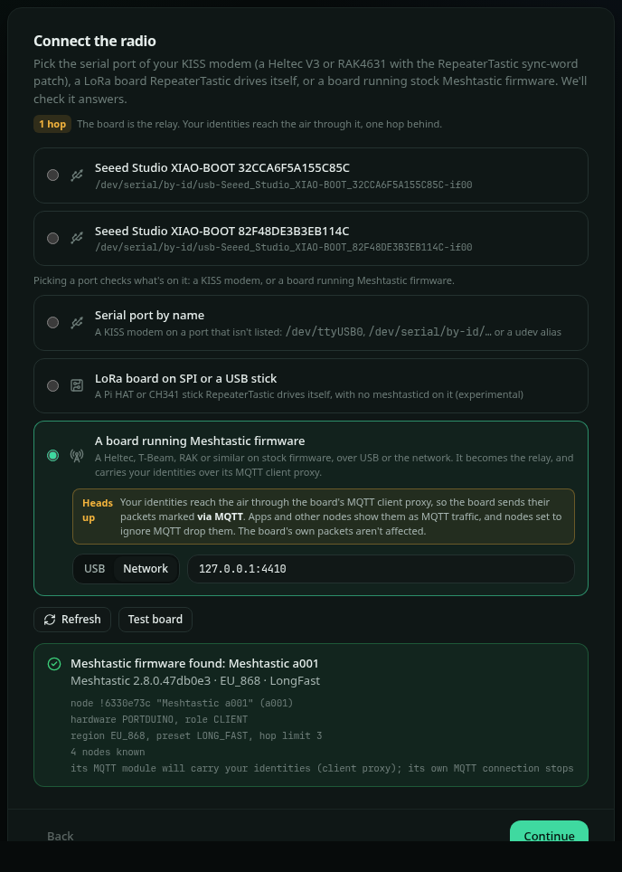
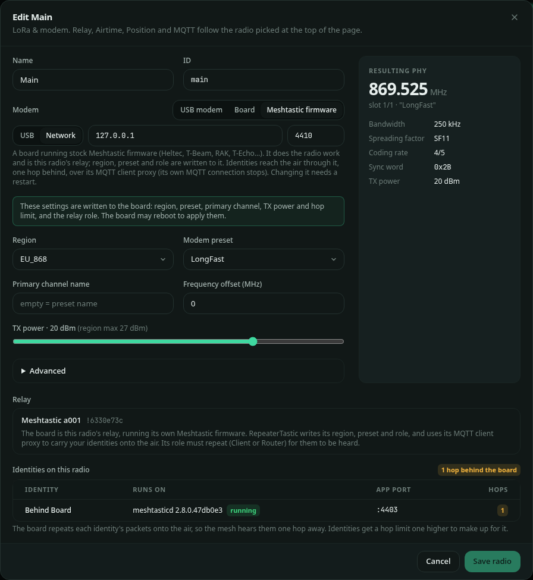

# Hardware and modems

[← README](../README.md) · [Configuration](configuration.md) · [Web GUI](web-gui.md) · [Several radios](radios.md) · [MQTT](mqtt.md) · [Architecture](architecture.md)

RepeaterTastic doesn't run Meshtastic firmware on the radio. It drives a plain LoRa board running
**Mesh KISS**: MeshCore's KISS modem firmware with a small patch
([`firmware/0001-kiss-modem-sync-word-preamble.patch`](../firmware/0001-kiss-modem-sync-word-preamble.patch))
that lets the host set Meshtastic's sync word (`0x2B`) and 16-symbol preamble. The board becomes a
dumb modem: it sends and receives frames, and all the Meshtastic logic runs on the host.

A Linux LoRa HAT or CH341 USB stick can be the radio too, with no modem board: RepeaterTastic
drives the chip itself (`radio.driver: spi`), see [LoRa HATs and USB sticks](#lora-hats-and-usb-sticks)
below.

## Boards

About 85 boards build, including:

| Board | Flash with |
| --- | --- |
| Heltec WiFi LoRa 32 V3 / V4 | `esptool --chip esp32s3 write_flash 0x0 <board>-factory.bin` |
| Heltec Wireless Tracker, Vision Master, T114, MeshSolar | esptool (ESP32) or UF2 (nRF52) |
| Seeed XIAO nRF52840 + Wio-SX1262 | UF2: double-tap reset, copy the `.uf2` to the drive |
| RAK WisBlock RAK4631, RAK3401 | UF2 |
| LilyGO T-Beam (SX1262 / SX1276) | `esptool --chip esp32 write_flash 0x0 <board>-factory.bin` |
| RP2040 and STM32 boards | UF2 (BOOTSEL) or SWD; see the table |

The full list, with the exact file and method per board, is
[`firmware/boards.md`](../firmware/boards.md). The Heltec V3 is the reference board: it is what
runs on air today.

## Get the firmware

- **Prebuilt:** each release has `kiss-firmware-<board>.zip` and an all-boards zip, plus
  `firmware-boards.md`. Get them from the
  [latest release](https://github.com/ScotMesh/RepeaterTastic/releases/latest), or for example:
  `gh release download -R ScotMesh/RepeaterTastic -p 'kiss-firmware-Heltec_v3_kiss_modem.zip'`.
- **Build:** `./firmware/build.sh Heltec_v3_kiss_modem` (PlatformIO; `./firmware/build.sh all` for
  every board). Images land in `firmware/out/<board>/`. See [`firmware/README.md`](../firmware/README.md).

## Flash it

**ESP32 boards (Heltec V3 shown):**

```bash
pip install esptool
esptool.py --chip esp32s3 --port /dev/ttyUSB0 erase_flash                  # fresh install
esptool.py --chip esp32s3 --port /dev/ttyUSB0 --baud 921600 write_flash 0x0 Heltec_v3_kiss_modem-factory.bin
```

If the port doesn't answer, hold **PRG**, tap **RST** and release **PRG** to enter the bootloader.

**nRF52 boards (XIAO nRF52840, RAK4631, T114, …):** double-tap reset, and a USB drive appears.
Copy the `.uf2` onto it and the board reboots into the modem firmware.

## Check the modem

`kisstool` ships with RepeaterTastic (`docker exec repeatertastic kisstool …` in the container):

```bash
kisstool info --dev /dev/ttyUSB0            # firmware version (2 or higher), board, radio, noise floor, counters
kisstool listen --dev /dev/ttyUSB0 --region EU_868 --preset LONG_FAST      # print Meshtastic frames it hears
kisstool send-text --dev /dev/ttyUSB0 --region EU_868 --preset LONG_FAST "hello"
```

Firmware version **1** means stock MeshCore KISS, which can't use Meshtastic's sync word: flash Mesh
KISS. The web GUI shows the version too ("Mesh KISS v2"). Stop RepeaterTastic first: only one program
can open the port.

## Connect it to the host

### Use a stable device path

`/dev/ttyUSB0` and `/dev/ttyACM0` can swap when boards are replugged or several are attached. Use
the by-id path instead:

```bash
ls -l /dev/serial/by-id/
# usb-Silicon_Labs_CP2102_USB_to_UART_Bridge_Controller_0001-if00-port0 -> ../../ttyUSB0
```

Put that path in `radio.device` (or pick it in the setup wizard or Configuration → Radios → Edit).

For a short name, add a udev rule, for example `/etc/udev/rules/99-meshtastic-modem.rules`:

```
SUBSYSTEM=="tty", ATTRS{idVendor}=="10c4", ATTRS{idProduct}=="ea60", ATTRS{serial}=="0001", SYMLINK+="mesh-modem"
```

then `sudo udevadm control --reload && sudo udevadm trigger`, and use `/dev/mesh-modem`.

### Permissions

The service user must be able to open the port: it has to be in the group that owns the device,
usually `dialout` (`ls -l /dev/ttyUSB0`). `deploy/install.sh` adds the `repeatertastic` user to
`dialout`, and the systemd unit allows `ttyUSB` and `ttyACM` devices.

### Docker

Pass the device in and add the group that owns it:

```bash
docker run … \
  --device /dev/serial/by-id/usb-…-if00-port0:/dev/ttyUSB0 \
  --group-add "$(getent group dialout | cut -d: -f3)" \
  ghcr.io/scotmesh/repeatertastic:latest
```

- The image includes meshtasticd, which runs every node inside the container. Its API ports
  (4500 up) stay inside: don't publish them.
- `--network host` lets the apps find identities over mDNS and joins the LAN multicast mesh. Without
  it, publish `-p 8080:8080 -p 4403-4410:4403-4410` instead.
- A LoRa HAT needs `--device /dev/spidev0.0 --device /dev/gpiochip0` and the `spi` and `gpio`
  groups. A CH341 stick needs `--device /dev/bus/usb` and its udev group.
- Prefer Compose? Copy [`deploy/docker-compose.example.yml`](../deploy/docker-compose.example.yml).

- Map the **by-id** path on the host to a fixed name inside the container.
- If the board is unplugged and replugged, recreate the container (`docker compose up -d
  --force-recreate`) so it gets the new device node.
- For several modems, add one `--device` per board and set each radio's device in Configuration → Radios.

## LoRa HATs and USB sticks

The `spi` driver talks to the LoRa chip directly over spidev and GPIO, or over a CH341 USB-to-SPI
adapter, using meshtasticd's own board files (all 61 are built in, plus anything in
`/etc/meshtasticd/config.d`). meshtasticd must be stopped: one program owns the radio.

| Chip | Boards |
| --- | --- |
| SX1262, SX1268, LLCC68 | MeshAdv Pi Hat and Mini, Waveshare SX126x, RAK6421 + RAK13300/13302, NebraHat, ZebraHat, PiMesh 1W, PiTastic, Femtofox, Luckfox Lyra/Pico, Station G3, ECB41 and OK3506 variants |
| SX1262/SX1268 on CH341 USB | MeshStick, Meshtoad, RAK19714, uMesh 30 dBm, FrameTastic, PiNedio USB, XIAO + Wio-SX1262 with the CH341 bridge firmware |
| LR1121 | Femtofox E80, PiggyStick |
| SX1276/SX1278 (RF95) | Adafruit RFM9x |
| SX1280 | 2.4 GHz boards wired like meshtasticd's `Module: sx1280` |

Pick the board in the setup wizard (**LoRa board on SPI or a USB stick**), or in the config:

```yaml
radio:
    driver: spi
    device: MeshAdv-900M30S   # a built-in board name, a board file path, or auto
```

`auto` detects CH341 sticks, Pi HAT+ boards and RAK boards with an ID EEPROM, as meshtasticd does.
`kisstool boards` lists the built-in names; `kisstool info --board <name>` checks the chip answers.

Permissions: the `spi` and `gpio` groups for a HAT (`/dev/spidev*`, `/dev/gpiochip*`); for a
CH341 stick a udev rule such as
`SUBSYSTEM=="usb", ATTRS{idVendor}=="1a86", ATTRS{idProduct}=="5512", MODE="0660", GROUP="plugdev"`.
In Docker pass the devices with `--device` and the groups with `--group-add`.

Status: tested on air with an SX1262 over CH341 (EU_868 LongFast, receive and transmit against a
live mesh). HATs, LR1121, RF95 and SX1280 follow the same datasheets and RadioLib sequences but
haven't been run on hardware yet; [LoRa HATs and USB sticks](spi-radio-testing.md) is the
step-by-step test guide, and reports are welcome.

## Boards on Meshtastic firmware

A board running stock Meshtastic firmware (Heltec, T-Beam, RAK, T-Echo and the like) can be a
radio too, over USB or its network API: `driver: meshtastic`, or **A board running Meshtastic
firmware** in the setup wizard, or the **Meshtastic firmware** tab under Configuration → Radios.
Picking its serial port in the wizard detects the firmware and switches to this option.



- **The board is the relay.** It keeps its own key and node number and does its own radio work.
  RepeaterTastic writes the radio settings (region, preset, primary channel, TX power, hop limit)
  and the relay role to it.
- **Identities are one hop behind it.** They run on meshtasticd (installed or Docker, see
  [`hosted`](configuration.md#hosted-meshtasticd)). There's no fallback: an identity stays off air,
  retrying with backoff, until meshtasticd can run. Their packets go to the board through its
  **MQTT client proxy**. The
  board repeats them onto the air one hop lower, so identities get a hop limit one higher. Everything
  the board hears comes back the same way, with the RSSI and SNR it measured.
- **Identities show as MQTT traffic.** The firmware marks everything it takes in over MQTT as
  "via MQTT" and keeps that flag when it repeats it on air. Apps and other nodes show your
  identities' packets as sent via MQTT, and nodes with "ignore MQTT" set drop them. The board's own
  packets are unaffected. The GUI says so wherever a board radio is chosen or shown.
- **No direct messages to identities.** Firmware 2.8.0 passes on only what it can read, and a
  direct message for one of your identities is encrypted for that identity, so it never reaches
  RepeaterTastic. Channel messages both ways and direct messages from your identities work (the
  board is given the recipient as a contact first, since it only takes a direct message over MQTT
  when it knows both ends). Messages between the board and an identity go over the air.
- **The board must repeat.** A role like Client or Router works; Client mute or rebroadcast mode
  None keeps identities off the air.
- **Its MQTT module is taken over.** RepeaterTastic turns on the client proxy with encryption,
  sets the server address to 127.0.0.1 (so other nodes' packets are passed on), switches map
  reports and "ignore MQTT" off, and turns on uplink and downlink on every channel. The board's own
  MQTT connection stops; use RepeaterTastic's MQTT links instead.
- **Channels.** An identity's channel packets only go out on channels the board also has (same
  name and key). Direct messages use the PKI path and need the board to have heard both nodes.
- One program at a time: close the Meshtastic app's USB connection, or a serial board has no room
  for RepeaterTastic.



## Several modems

Each extra radio is another board on its own USB port, set up in Configuration → Radios → Add radio
(or under `radios:` in the config). Two radios can't share a device. See [Several radios](radios.md).

## Antennas, power and the law

- Set `mesh.tx_power_dbm` to what your board and antenna gain allow in your region; SX1262 boards
  top out at 22 dBm.
- RepeaterTastic enforces the region's duty cycle (EU_868: 10% of each hour) unless you override it.
- A modem on a site shared with other transmitters may need filtering and some antenna separation.
  Check the noise floor on the Dashboard and Statistics pages.

## Troubleshooting

| Symptom | Likely cause |
| --- | --- |
| "radio not available yet" in the log | Wrong device path, board unplugged, or the port is in use (stop `kisstool`, other daemons) |
| "permission denied" opening the port | Service user not in `dialout`, or the container is missing `--group-add` |
| "rejected Meshtastic's sync word" | Stock MeshCore KISS firmware: flash Mesh KISS |
| Modem connected, nothing heard | Region, preset or primary channel name don't match the mesh; antenna not attached |
| `rx` counter rises but nothing decodes | PHY mismatch (preset, bandwidth) or a different channel key |
| Heard, but nobody hears us | Duty-cycle budget used up, TX power too low, or the relay in `monitor` or `off` mode (nothing is sent). `client_mute` only stops repeating |

The [bench test](bench-test.md) walks through a first real-radio test step by step.
